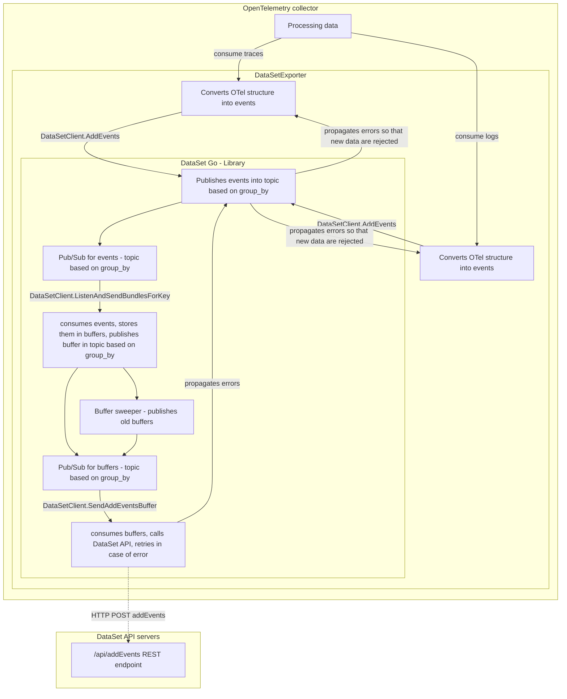

# DataSet-Go

[](https://pkg.go.dev/github.com/scalyr/dataset-go)
[](https://goreportcard.com/report/github.com/scalyr/dataset-go)
[](https://github.com/scalyr/dataset-go/actions/workflows/code-quality.yaml)
[](https://github.com/scalyr/dataset-go/actions/workflows/secrets-scanner.yaml)
[](https://codecov.io/gh/scalyr/dataset-go)
[](https://github.com/scalyr/dataset-go/releases)

This repository holds the source code for the Go wrapper around [DataSet API](https://app.scalyr.com/help/api).

To learn more about DataSet, visit https://www.dataset.com.

## Features

The DataSet API supports following API calls:

* [addEvents](https://app.scalyr.com/help/api#addEvents) - This endpoint inserts one or more structured or unstructured log events. It can scale horizontally to ingest 100s of TBs per day.


## Examples

```go
// create logger
logger := zap.Must(zap.NewDevelopment())
// read configuration from env variables
cfg, err := config.New(config.FromEnv())
if err != nil { panic(err) }

// build client
cl, err := client.NewClient(cfg, &http.Client{}, logger)
if err != nil { panic(err) }

// send all buffers when we want to finish
defer cl.SendAllAddEventsBuffers()

// send bundles
err = cl.AddEvents(makeBundles())
if err != nil { panic(err) }
```

Full example can be found in [examples/readme/](examples/readme/main.go)

### All examples:

Examples are located in the [examples](examples) folder.
* [simple client](examples/client/main.go) - simple client
* [readme](examples/readme/main.go) - full example from readme


## Release Notes and Changelog

For release notes please see [RELEASE_NOTES.md](RELEASE_NOTES.md) document and for changelog,
see [CHANGELOG.md](CHANGELOG.md) document.

## Developing

### Install Dev Tools

Run following script - [install-dev-tools.sh](scripts/install-dev-tools.sh) - to install
tools needed by `pre-commit`.

### Pre-Commit Hooks

[Pre-commit](https://pre-commit.com) is used to automatically run checks including Black formatting
prior to a git commit.

To use pre-commit:

- Use one of the [Installation Methods](https://pre-commit.com/#install) from the documentation.
- Install the hooks with `pre-commit install`.
- To manually execute the pre-commit hooks (including black), run `pre-commit run --all-files` (
  run it on all the files) or ``pre-commit run`` (run it only on staged files).

#### Pre-commit Configuration

- `.pre-commit-config.yaml` configures the scripts run by pre-commit

To update the Pre-commit hooks , run `pre-commit autoupdate`. This will update
`.pre-commit-config.yaml` and will need to be committed to the repository.

## Contributing

In the future, we will be pushing guidelines on how to contribute to this repository.  For now, please just
feel free to submit pull requests to the `main` branch and we will work with you.

## Copyright, License, and Contributors Agreement

Copyright 2023 SentinelOne, Inc.

Licensed under the Apache License, Version 2.0 (the "License"); you may not use this work except in
compliance with the License. You may obtain a copy of the License in the [LICENSE](LICENSE) file, or at:

[http://www.apache.org/licenses/LICENSE-2.0](http://www.apache.org/licenses/LICENSE-2.0)

By contributing you agree that these contributions are your own (or approved by your employer) and you
grant a full, complete, irrevocable copyright license to all users and developers of the project,
present and future, pursuant to the license of the project.

## Architecture

see detailed [Architecture description](docs/ARCHITECTURE.md)

TODO
  - add explanation why we have this architecture - pub/sub, events, buffers, grouping, sessions, DataSet addEvents session limitations, etc.

